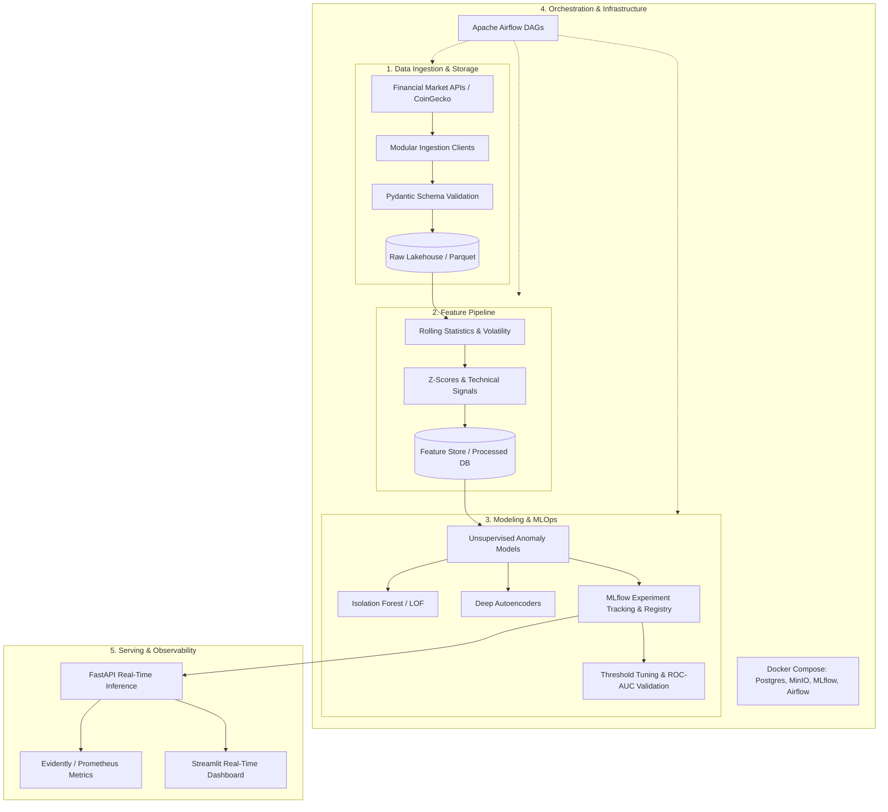

# Asset Anomaly Detection (MLOps)

[](https://www.python.org/downloads/)
[](https://github.com/astral-sh/ruff)
[](https://mlflow.org/)
[](https://fastapi.tiangolo.com/)

An end-to-end production-grade MLOps platform for detecting anomalies in financial and cryptocurrency market asset time-series. The system continuously ingests multi-source market metrics, processes sliding-window features, trains unsupervised anomaly detection models tracked via MLflow, orchestrates pipelines with Apache Airflow, and serves real-time inference with data drift monitoring.

---

## 🏛 System Architecture



---

## 🛠 Tech Stack

- **Core & Data Processing**: Python 3.11+, Pandas, NumPy, PyArrow, Pydantic v2
- **Machine Learning & Modeling**: Scikit-Learn (Isolation Forest, Local Outlier Factor), PyTorch/Keras (Autoencoders)
- **Experiment Tracking & Model Registry**: MLflow, MinIO (S3-compatible artifact storage)
- **Pipeline Orchestration**: Apache Airflow, Docker Compose
- **Model Serving & API**: FastAPI, Uvicorn, HTTPX
- **Observability & UI**: Evidently AI, Prometheus, Streamlit
- **Code Quality & Testing**: Ruff, Mypy, Pytest, Pytest-Cov

---

## 📂 Repository Structure

```text
asset-anomaly-detection/
├── .env.example              # Environment variables template
├── .gitignore                # Git ignore patterns
├── pyproject.toml            # Project dependencies and tool configs
├── README.md                 # Project documentation
├── dags/                     # Apache Airflow DAG definitions
├── data/                     # Local data storage (raw, processed, features - gitignored)
├── docs/                     # Project documentation and issue tracking
│   └── issue_0_setup.md      # Day 0 setup checklist and roadmap
├── infra/                    # Infrastructure and container configurations
│   └── docker/               # Dockerfiles and docker-compose definitions
├── src/                      # Source code modules
│   ├── ingestion/            # API connectors, extraction, and validation schemas
│   ├── features/             # Feature extractors and rolling window transformers
│   ├── models/               # Anomaly detection models, evaluation, and registry
│   ├── pipelines/            # End-to-end training and inference pipeline orchestration
│   ├── serving/              # FastAPI application and inference endpoints
│   └── utils/                # Logging, configuration, and shared utilities
└── tests/                    # Unit and integration test suites
    ├── unit/                 # Unit test cases
    └── integration/          # End-to-end integration tests
```

---

## 🗺 Milestones & Issue Roadmap

The project is structured into **5 Milestones** containing **22 atomic issues**:

- **Milestone 1: Data Ingestion & Storage Architecture** (Issues #1 to #5)
  - Base connectors, CoinGecko/market clients, Pydantic schemas, Parquet storage sink, unit tests.
- **Milestone 2: Feature Engineering & Processing Pipeline** (Issues #6 to #9)
  - Rolling window features, volatility & momentum signals, feature persistence, quality validation.
- **Milestone 3: Anomaly Detection Modeling & MLflow Registry** (Issues #10 to #14)
  - Isolation Forest baseline, Autoencoder models, MLflow tracking, evaluation thresholding, packaging.
- **Milestone 4: Orchestration & MLOps Infrastructure** (Issues #15 to #18)
  - Docker Compose environment (Postgres, MinIO, MLflow, Airflow), training & ingestion DAGs, integration tests.
- **Milestone 5: Serving, Real-Time API & Monitoring** (Issues #19 to #22)
  - FastAPI inference service, drift detection (Evidently/Prometheus), Streamlit UI, GitHub Actions CI/CD.

---

## 🌿 Git Flow Guidelines

We strictly adhere to standard Git Flow practices:
- **`main`**: Production branch. Always deployable and green.
- **`develop`**: Integration branch for tested features.
- **`feature/issue-<ID>-<description>`**: Dedicated branch per issue branched from `develop`.
- **Pull Requests**: Every feature branch must be merged into `develop` through a pull request referencing `Closes #<ID>`.
- **Releases**: `develop` is merged into `main` only when completing a Milestone.

---

## 🚀 Quickstart & Setup

### 1. Clone the repository
```bash
git clone https://github.com/ale-camer/asset-anomaly-detection.git
cd asset-anomaly-detection
```

### 2. Create and activate virtual environment
```bash
python3 -m venv .venv
source .venv/bin/activate
```

### 3. Install dependencies
```bash
pip install -e ".[dev]"
```

### 4. Configure environment variables
```bash
cp .env.example .env
```

### 5. Run tests and linting
```bash
ruff check .
pytest
```
