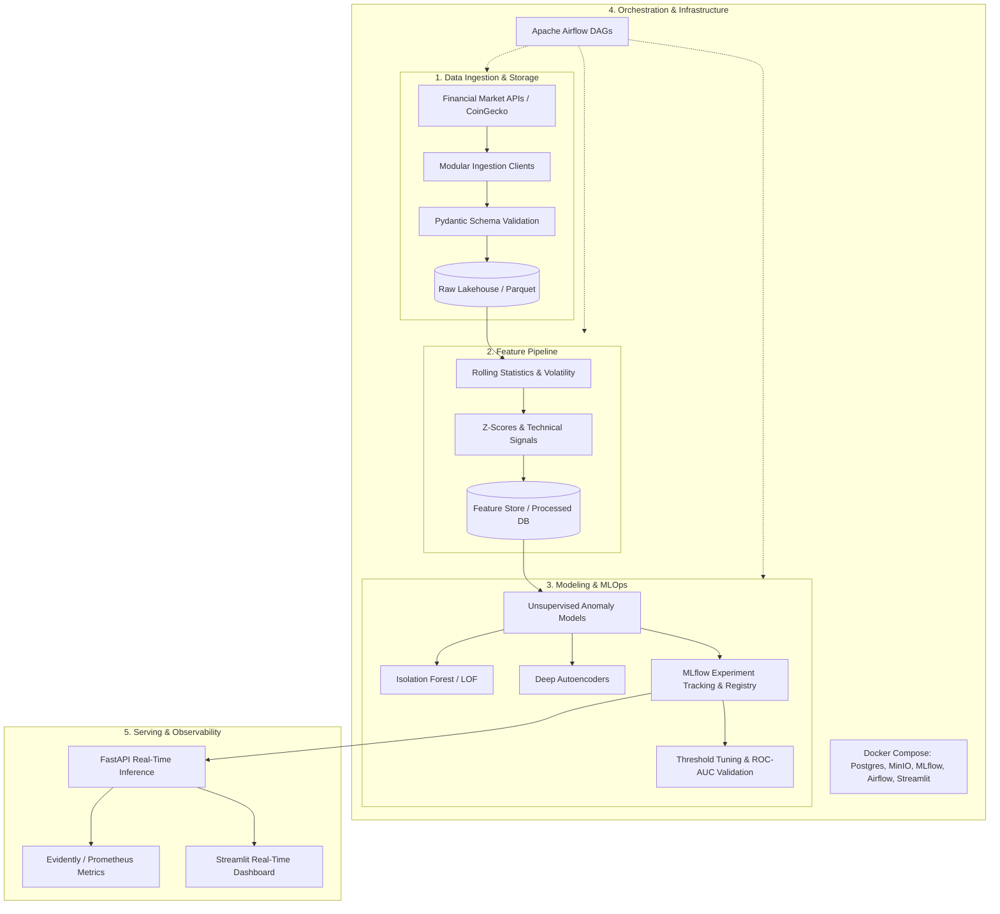

# Asset Anomaly Detection (MLOps)

[](https://github.com/ale-camer/asset-anomaly-detection/actions/workflows/ci.yml)
[](https://www.python.org/downloads/)
[](https://github.com/astral-sh/ruff)
[](https://mlflow.org/)
[](https://fastapi.tiangolo.com/)
[](https://streamlit.io/)

An end-to-end production-grade MLOps platform for detecting anomalies in financial and cryptocurrency market asset time-series. The system continuously ingests multi-source market metrics, processes sliding-window features, trains unsupervised anomaly detection models tracked via MLflow, orchestrates pipelines with Apache Airflow, and serves real-time inference with data drift monitoring and an interactive Streamlit UI.

---

## 🏛 System Architecture



---

## 🛠 Tech Stack

- **Core & Data Processing**: Python 3.11+, Pandas, NumPy, PyArrow, Pydantic v2
- **Machine Learning & Modeling**: Scikit-Learn (Isolation Forest, Local Outlier Factor), PyTorch (Deep Autoencoders)
- **Experiment Tracking & Model Registry**: MLflow, MinIO (S3-compatible artifact storage)
- **Pipeline Orchestration**: Apache Airflow, Docker Compose
- **Model Serving & API**: FastAPI, Uvicorn, HTTPX, Prometheus Client
- **Observability & UI**: Evidently AI, Prometheus, Streamlit
- **Code Quality & Testing**: Ruff, Mypy, Pytest, Pytest-Cov, GitHub Actions CI

---

## 📂 Repository Structure

```text
asset-anomaly-detection/
├── .github/                  # GitHub Actions CI/CD workflows
│   └── workflows/ci.yml      # Automated lint, type checks, unit tests, and docker builds
├── .env.example              # Environment variables template
├── .gitignore                # Git ignore patterns
├── pyproject.toml            # Project dependencies and tool configs
├── README.md                 # Project documentation
├── dags/                     # Apache Airflow DAG definitions
│   ├── market_data_pipeline.py       # Ingestion & feature transformation DAG
│   └── model_retraining_pipeline.py  # Model retraining, validation & registry DAG
├── data/                     # Local data lakehouse (raw, processed, features, reports)
├── docker/                   # Docker build definitions
│   ├── mlflow/Dockerfile     # MLflow server image
│   └── streamlit/Dockerfile  # Streamlit dashboard image
├── docker-compose.yml        # Multi-service stack (Postgres, MinIO, MLflow, Airflow, Streamlit)
├── docs/                     # Project documentation and issue tracking plans (Issue #0 to #22)
├── src/                      # Source code modules
│   ├── api/                  # FastAPI inference endpoints, schemas, and Prometheus metrics
│   ├── features/             # Feature extractors and rolling window transformers
│   ├── ingestion/            # API connectors, extraction, and validation schemas
│   ├── models/               # Anomaly detection models, evaluation metrics, and registry
│   ├── monitoring/           # Evidently AI Data Drift & Concept Drift monitoring
│   ├── storage/              # Parquet lakehouse sink and feature store adapters
│   ├── ui/                   # Streamlit interactive dashboard, API client, and alerting
│   └── utils/                # Logging, configuration settings, and shared utilities
└── tests/                    # Unit and integration test suites
    ├── unit/                 # Unit test cases across all modules
    └── integration/          # End-to-end orchestration tests
```

---

## 🗺 Milestones & Issue Roadmap

The project is structured into **5 Milestones** containing **22 atomic issues**, all completed:

- ✅ **Milestone 1: Data Ingestion & Storage Architecture** (Issues #1 to #5)
  - Base connectors, CoinGecko market client, Pydantic validation schemas, Parquet storage sink, unit tests.
- ✅ **Milestone 2: Feature Engineering & Processing Pipeline** (Issues #6 to #9)
  - Rolling window features, Parkinson volatility & momentum signals, feature persistence, quality validation.
- ✅ **Milestone 3: Anomaly Detection Modeling & MLflow Registry** (Issues #10 to #14)
  - Isolation Forest baseline, PyTorch Autoencoder, MLflow tracking, dynamic thresholding & ROC-AUC, packaging.
- ✅ **Milestone 4: Orchestration & MLOps Infrastructure** (Issues #15 to #18)
  - Docker Compose stack (Postgres, MinIO, MLflow, Airflow), ingestion & retraining DAGs, E2E orchestration tests.
- ✅ **Milestone 5: Serving, Real-Time API & Monitoring** (Issues #19 to #22)
  - FastAPI inference service (`/predict`, `/health`), Prometheus metrics, Evidently drift reports, Streamlit UI, GitHub Actions CI.

---

## 🌿 Git Flow Guidelines

We strictly adhere to standard Git Flow practices:
- **`main`**: Production branch. Always deployable and green.
- **`develop`**: Integration branch for tested features.
- **`feature/issue-<ID>-<description>`**: Dedicated branch per issue branched from `develop`.
- **Pull Requests**: Every feature branch is merged into `develop` through pull requests.
- **Releases**: `develop` is merged into `main` with semantic version tags (e.g. `v1.0.0`).

---

## 🚀 Quickstart & Setup

### 1. Clone the repository
```bash
git clone https://github.com/ale-camer/asset-anomaly-detection.git
cd asset-anomaly-detection
```

### 2. Create and activate virtual environment
```bash
python3 -m venv .venv
source .venv/bin/activate
```

### 3. Install dependencies
```bash
pip install -e ".[dev]"
```

### 4. Configure environment variables
```bash
cp .env.example .env
```

### 5. Run tests, style checks and type checks
```bash
pytest
ruff check .
mypy src/ tests/
```

---

## 🖥 Services & Execution

### 1. Docker Compose Infrastructure
Launch all platform services (PostgreSQL, MinIO S3, MLflow, Airflow, Streamlit):
```bash
docker compose up -d
```

| Service | URL | Credentials |
| :--- | :--- | :--- |
| **Streamlit Dashboard** | [http://localhost:8501](http://localhost:8501) | N/A |
| **Airflow Webserver** | [http://localhost:8080](http://localhost:8080) | `admin` / `admin` |
| **MLflow Tracking** | [http://localhost:5000](http://localhost:5000) | N/A |
| **MinIO Console** | [http://localhost:9001](http://localhost:9001) | `minioadmin` / `minioadmin` |

### 2. FastAPI Real-Time Inference Service
Run the API locally using Uvicorn:
```bash
uvicorn src.api.main:app --host 0.0.0.0 --port 8000 --reload
```
- Interactive Swagger UI: [http://localhost:8000/docs](http://localhost:8000/docs)
- Health Check: `GET http://localhost:8000/health`
- Prometheus Metrics: `GET http://localhost:8000/metrics`
- Anomaly Prediction: `POST http://localhost:8000/predict`

### 3. Streamlit Real-Time Dashboard
Run the dashboard locally:
```bash
streamlit run src/ui/app.py
```
- **Timeline Tab**: Time-series charts with anomaly flags, rolling statistics, and severity breakdown.
- **Simulator Tab**: Interactive market condition testing against the live FastAPI endpoint with instant alerting.
- **Drift Tab**: Embedded Evidently AI Data Drift report viewer.

### 4. Data Drift Monitoring
Generate an Evidently AI Data Drift report comparing baseline training data against live inference:
```python
from src.monitoring.drift import generate_drift_report
import pandas as pd

# Load reference and current datasets
report_path = generate_drift_report(reference_df, current_df)
print(f"Report saved to: {report_path}")
```
Reports are automatically saved as HTML in `data/processed/reports/data_drift_report.html` and displayed in the Streamlit UI.
