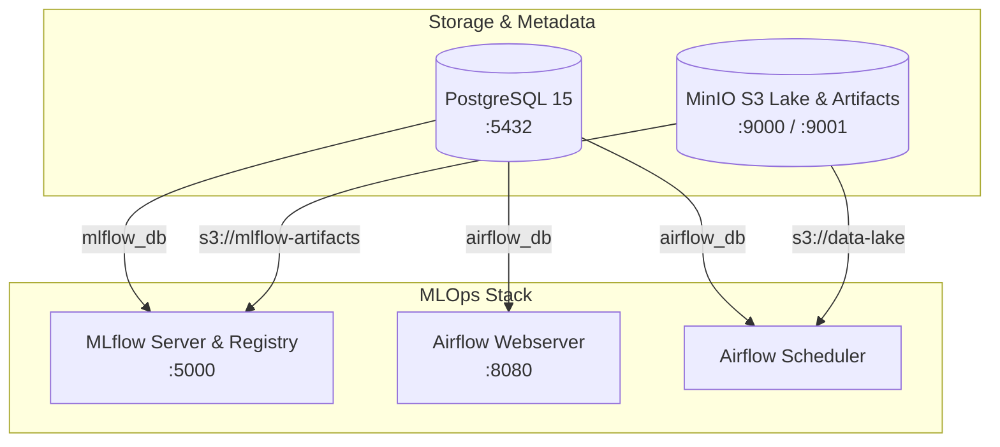

# Infraestructura y Orquestación con Docker Compose

Este documento detalla la arquitectura, configuración y puesta en marcha del stack de infraestructura del proyecto mediante **Docker Compose**.

---

## 🏛 Arquitectura de Servicios

El archivo [`docker-compose.yml`](../docker-compose.yml) orquesta los siguientes componentes centrales para el ciclo de vida MLOps:



1. **PostgreSQL (`postgres-metadata`)**:
   - Backend unificado de metadatos relacionales.
   - Crea automáticamente las bases de datos `anomaly_detection_db`, `mlflow_db` y `airflow_db` mediante [`docker/postgres/init.sql`](../docker/postgres/init.sql).
2. **MinIO (`minio-lake` & `minio-init-buckets`)**:
   - Almacenamiento de objetos compatible con AWS S3.
   - Inicializa automáticamente los buckets:
     - `mlflow-artifacts`: Serialización de modelos y experimentos.
     - `data-lake`: Almacenamiento Parquet particionado para datos crudos, procesados y features.
3. **MLflow Tracking & Model Registry (`mlflow-server`)**:
   - Servidor central de tracking de experimentos, métricas, hiperparámetros y registro de modelos empaquetados.
4. **Apache Airflow (`airflow-webserver` & `airflow-scheduler`)**:
   - Orquestador de DAGs de ingesta de datos, feature engineering, reentrenamiento y monitoreo de drift.
   - Configurado con `LocalExecutor` para ejecución eficiente de tareas.

---

## 🚀 Puesta en Marcha

### 1. Configurar Variables de Entorno
Copia la plantilla base a un archivo `.env`:

```bash
cp .env.example .env
```

### 2. Iniciar el Stack
Levanta todos los servicios en segundo plano:

```bash
docker compose up -d
```

### 3. Verificar el Estado de los Contenedores
```bash
docker compose ps
```

---

## 🌐 Endpoints y Accesos

| Servicio | URL / Host | Puerto | Credenciales por Defecto |
| :--- | :--- | :--- | :--- |
| **MLflow UI** | `http://localhost:5000` | `5000` | *Sin autenticación* |
| **MinIO Console** | `http://localhost:9001` | `9001` | `minioadmin` / `minioadmin` |
| **MinIO S3 API** | `http://localhost:9000` | `9000` | `minioadmin` / `minioadmin` |
| **Airflow Webserver** | `http://localhost:8080` | `8080` | `admin` / `admin` |
| **PostgreSQL** | `localhost:5432` | `5432` | `mlops_user` / `mlops_password` |

---

## 🛑 Detener y Limpiar Infraestructura

- **Detener servicios manteniendo datos persistentes**:
  ```bash
  docker compose down
  ```

- **Detener y eliminar volúmenes de datos**:
  ```bash
  docker compose down -v
  ```
